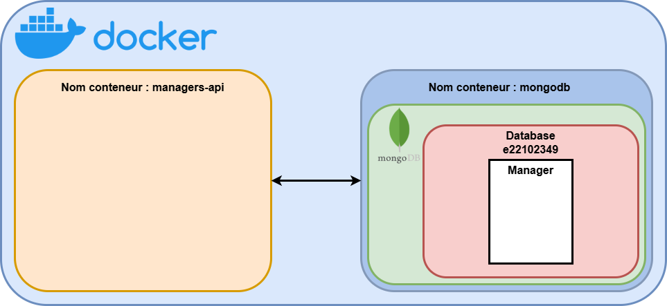

# EtuGestion
[](https://www.java.com)
[](https://vuejs.org/)
[](https://jakarta.ee/specifications/servlet/)
[](https://www.mongodb.com/)
[](https://mariadb.org/)


## Description Générale
Ce projet gère l’inscription d’étudiants à une année universitaire.Deux types d’utilisateurs interagissent avec le système : les étudiants, qui s’inscrivent, choisissent des options et consultent leurs affectations, et le responsable des formations, qui définit les formations, valide les inscriptions et gère les affectations en TD/TP. 

Pour réaliser cette application plusieurs micro-services ont été conceptualisé : authentication, core, academic-year-scraper, academic-year, student, message, responsable et student-parser. Nous avons implémenter les services core, academic-year et manager.

## Core (Spring Boot)
Le service Core constitue le cœur de l’application EtuGestion. Il centralise et fournit les API indispensables à la gestion des étudiants, des utilisateurs ainsi que d’autres entités centrales du système.

### Fonctionnalités

#### Gestion des utilisateurs et authentification  
Mise en place des mécanismes d’inscription et de connexion  

#### Gestion des données des étudiants  
Création, lecture, mise à jour et suppression (CRUD) des informations relatives aux étudiants  

#### Gestion des responsables  
Permet de gérer les responsables  
Cela inclut la création et la gestion de leurs informations personnelles (CRUD)  

#### Gestion des formations  
Administration des programmes de formation (par exemple, Master Tiila ou L3 IFA)  
Cette fonctionnalité permet de définir, planifier et gérer les cursus d’études proposés  

#### Fonctionnalités supplémentaires (implémentées)  
Création de compte suite à la création d'un étudiant  
Création de message suite à la création d'un étudiant et à sa validation dans une formation  


## AcademicYear (Spring Boot - MariaDB)
Ce micro-service permet la gestion des formations.  
Cela inclut une gestion CRUD des formations, des groupes, des unités d'enseignement et des demandes d'inscription.

### Fonctionnalités spécifiques
#### Inscription à un groupe
Lorsqu'un étudiant fait une demande d'inscription, elle est enregistrée dans la table des demandes. Il est possible de l'accepter ou de la refuser. Lorsqu'elle est acceptée, l'étudiant est ajouté dans deux groupes de TD et de TP contenant le moins d'étudiants. Si aucun groupe n'a de place disponible, l'étudiant n'est pas ajouté.  
Amélioration possible : création automatique d'un nouveau groupe avec équilibrage.

#### Inscription à une unité d'enseignement
Lors de l'ajout d'une unité d'enseignement, si elle est obligatoire, tous les étudiants présents dans la formation sont ajoutés. Lors de l'inscription à une UE optionnelle, avant d'ajouter l'étudiant, on vérifie que l'unité d'enseignement n'est pas pleine.

### Base de données
academic_years(id, name, praticalWorkSize, directedWorkSize, numberOptionalTeachingUnit, responsibleId)
  - id: Long
  - name: String
  - praticalWorkSize: Short
  - directedWorkSize: Short
  - numberOptionalTeachingUnit: Short
  - responsibleId: Long

groups(id, name, academic_year_id, studentsIds)
  - id: Long
  - name: String
  - academic_year_id: Long (FK)
  - studentsIds: List<Long>

requests(id, studentId, academicYearId)
  - id: Long
  - studentId: Long
  - academicYearId: Long (FK)

teaching_units(id, name, isRequired, capacity, academic_year_id, responsibleId, studentsIds)
  - id: Long
  - name: String
  - isRequired: Boolean
  - capacity: Short
  - academic_year_id: Long (FK)
  - responsibleId: Long
  - studentsIds: List<Long>

relations:
  - academic_years(id) 1:N -> groups(academic_year_id)
  - academic_years(id) 1:N -> teaching_units(academic_year_id)
  - groups(id) N:1 -> academic_years(id)
  - teaching_units(id) N:1 -> academic_years(id)
  - requests(studentId) N:1 -> users(id) (Assumption: User entity exists)
  - requests(academicYearId) N:1 -> academic_years(id)


## Manager (Servlet - MongoDB)
Ce micro-service permet la gestion des responsables. Cela inclut la création et la gestion de leurs informations personnelles (CRUD).
### Description :
Tout d'abord un responsable est possède plusieurs informations : 
- Email
- Prénom
- Nom
#### Managers-api est une api de responsable qui gère :
- La récupération de tout les responsables dans la base de données.
- La récupération d'un seule responsable.
- La création d'un responsable.
- La suppresion d'un responsable.
- La mise à jour des données d'un responsable.

### Base de données
manager(id, nom, prenom, email)
  - id: Long
  - nom: String
  - prenom: String
  - email: String

#### MongoDB :
Celle-ci est constitué comme suit :  
Database :
```
e22102349
```
Collections dans la database :
```
Manager
```
#### Illustration de l'api responsable et de la base MongoDB sous Docker :

